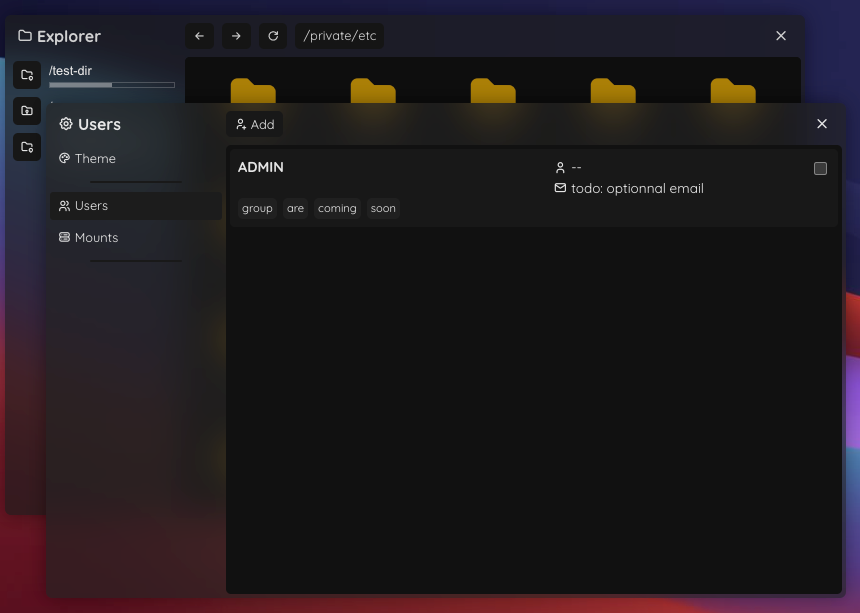
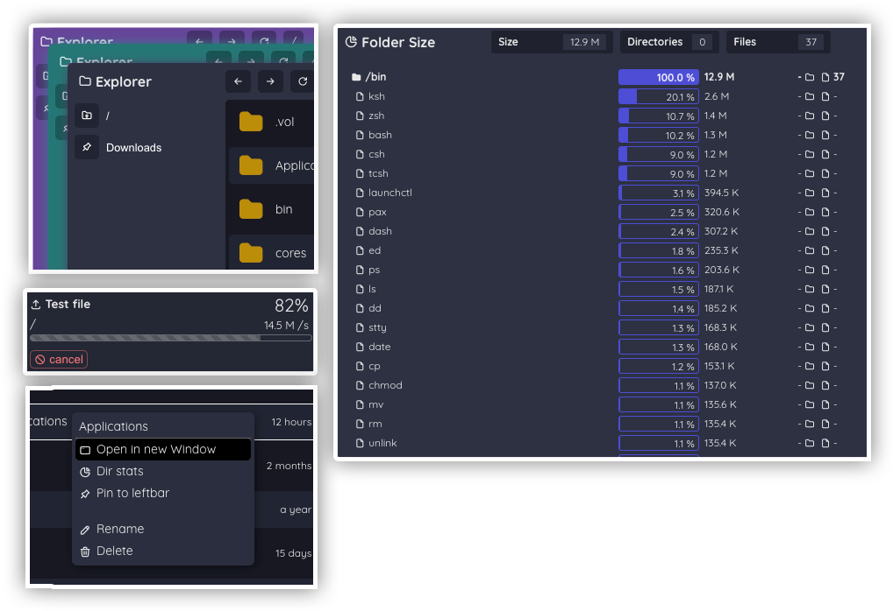

# Dowin File Manager

Dowin File Manager is a web-based file and server manager written in Node and Svelte

## Screenshots




## Current and planned features

This list is non-exhaustive and will grow larger during the developpement

- ✅ Multi-window file browsing
- ✅ File action
  - ✅ Rename
  - ✅ Delete
- ✅ File drag
  - ✅ Copy (with progress)
  - ✅ Move (with progress)
- ⚪ File and folder upload (drop)
  - ✅ Firefox
  - ⚪ Chromium based browser (folders not working yet)
- ⚪ User managing
  - ✅ Login
  - 🔴 Two Factor Authentication
  - ✅ Creation
  - ✅ Edition / Deletion
- ⚪ Compatibility
  - ⚪ MacOS
  - ⚪ Linux
  - 🔴 Windows
- 🔴 Theme customization
- 🔴 Public sharing
- 🔴 Thumbnail
- 🔴 File viewer
  - 🔴 Image + Basic Editor
  - 🔴 Video + Basic Editor
  - 🔴 Sound
  - 🔴 Documents
  - 🔴 3D Objects
  - 🔴 Code Editor
- 🔴 Group authorization
  - 🔴 read/write access per directory
- 🔴 Mobile UI
- 🔴 Real database instead of json
  - 🔴 MySQL ?
  - 🔴 PostgreSQL ?
  - 🔴 SQLite ?

| ✅ - Done | ⚪ - Partially done | 🔵 - Working on it | 🔴 - Not yet implemented |
| --------- | ------------------- | ------------------ | ------------------------ |

## Try it with Docker !

```
Placeholder docker
```

## Build it !

### Dependencies

- NodeJS 19.0 min, 20.10 recommended.

### Executing program

#### Backend

```sh
cd backend
npm install
npm run watch
```

### Front

```sh
cd front
npm install
npm run dev
```
